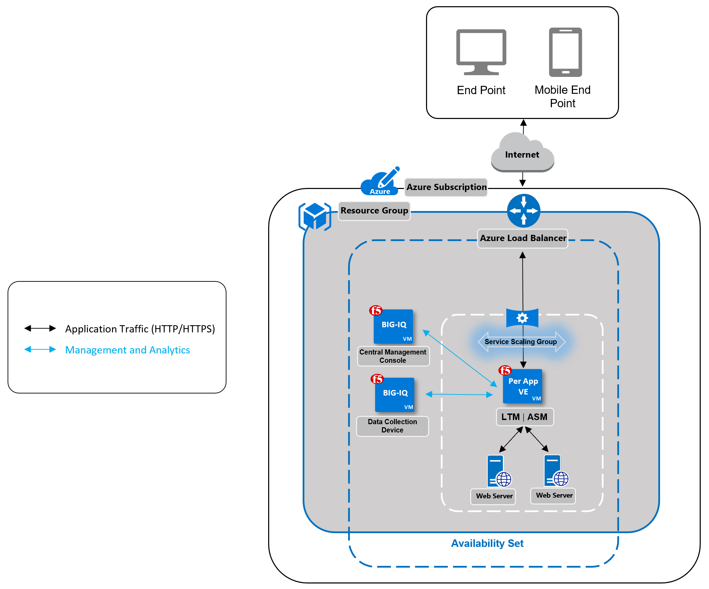

BIG-IP® Cloud Edition Trial Quick Start - Azure
===============================================

**Note:** Updated with BIG-IQ 6.1.0 and BIG-IP 13.1.1

Instructions for Azure
----------------------

To deploy this ARM template in Azure cloud, complete the following steps.

**Note:** This template is not supported in the regions where Microsoft/insights is not available.

1. To get a BIG-IQ trial license, go to [F5 Cloud Edition Trial](https://f5.com/products/trials/product-trials).

   Select **BIG-IP Cloud Edition - Advanced Web Application Firewall**

2. Enable programmatic deployment for these F5 products:

   * F5 BIG-IQ Virtual Edition - (BYOL): [Navigate to Home > Marketplace > F5 BIG-IQ BYOL > Configure Programmatic Deployment](https://portal.azure.com/#blade/Microsoft_Azure_Marketplace/GalleryFeaturedMenuItemBlade/selectedMenuItemId/home/searchQuery/f5/resetMenuId/)
   * F5 BIG-IP VE - ALL (BYOL, 1 Boot Location): [Navigate to Home > Marketplace > F5 BIG-IQ BYOL > Configure Programmatic Deployment](https://portal.azure.com/#blade/Microsoft_Azure_Marketplace/GalleryFeaturedMenuItemBlade/selectedMenuItemId/home/searchQuery/f5/resetMenuId/)

3. Launch the *trial stack* template by right-clicking this button and choosing **Open link in new window**:

    (new VPC/demo app)
   
4. In the ARM Template, populate this information:

   * Resource group (Select existing or create new resource group that makes resource termination painless)
   * Chose admin user name (default value is azureuser)
   * Chose authentication type (password of sshkey string)
   * Enter password / sshPublicKey for BigIq DCD , CM virtual machines (connect to VM using these credentials)
   * Chose Big IQ password (management console's password)
   * Service principal secret (Identity string created while app registration)
   * Enter azure client Id (Can be found under app registration section as Application ID)
   * Enter license keys of CM , DCD , BIG IP appropriately 
   * Location (default is resourceGroup's location - modify to deploy the resources in other location)
   * Enter ssg , dcd , cm instance names(must be fewer than 25 characters)

5. Accept the terms and conditions checkbox & launch the cloud deployment 

6. View required commands to connect to CM , DCD instances under outputs section.

   *Expected time: ~30 min*

Security instructions
---------------------
1. It is strongly recommended to configure autoshutdown / whitelist the public ip's in NSG from which one accesses the ssh port of the deployed azure VM's. (This template would deploy network security group with 22,80,443 ports open to the public)
2. Avoid enabling root account on publicly exposed azure VM's.

Teardown instructions
---------------------

Naviagate to resources under appropriate resource group and delete the respective resources associated with current deployment (can be found under resource group -> deployments, If a new resource group is created then simply deleting that resource group will remove all the associated resources).

Troubleshooting
---------------

1.  In BIG-IQ UI, if the application deployment failed, click Retry.
2.	In BIG-IQ UI, check BIG-IQ license on Console Node and Data Collection Device (System > THIS DEVICE > Licensing) and BIG-IP license pool (Devices > LICENSE MANAGEMENT > Licenses).
3.	In BIG-IQ UI, check the Cloud Environment if all the information are populated correctly (Applications > ENVIRONEMENTS > Cloud Environments).
4.	In BIG-IQ CLI, check following logs: /var/log/restjavad.0.log and /var/log/orchestrator.log.
5.  In Azure market place ensure that programmatic deployment is enabled for F5 products deployed earlier.
6.  In Azure Active directory make sure that app registration has all necessary permissions for api access, to delegate permissions to other users add the users to owner list of app regiration.
7.  Do not forget to assign contirbutor role (RBAC) to the scope of current resource/subscription associated with the app registration 
8. If encountered MarketPurchaseEligibility error while deploying template - Check the availability of bigip , bigiq etc 
        Eg: For Big ip:
        Get-AzureRmMarketplaceTerms -Publisher "f5-networks" -Product "f5-big-ip-byol" -Name "f5-big-all-1slot-byol" | Set-AzureRmMarketplaceTerms -Accept
9. If cloud provider test connection fails . Check whether the service prinicpal associated with application has all requried permissions , if yes and yet cloud provider connection is unsuccessful try to restart the VM's and check again.

### Copyright

Copyright 2014-2019 F5 Networks Inc.

### License

#### Apache V2.0

Licensed under the Apache License, Version 2.0 (the "License"); you may not use
this file except in compliance with the License. You may obtain a copy of the
License at

http://www.apache.org/licenses/LICENSE-2.0

Unless required by applicable law or agreed to in writing, software
distributed under the License is distributed on an "AS IS" BASIS,
WITHOUT WARRANTIES OR CONDITIONS OF ANY KIND, either express or implied.
See the License for the specific language governing permissions and limitations
under the License.

#### Contributor License Agreement

Individuals or business entities who contribute to this project must have
completed and submitted the [F5 Contributor License Agreement](http://f5-openstack-docs.readthedocs.io/en/latest/cla_landing.html).
